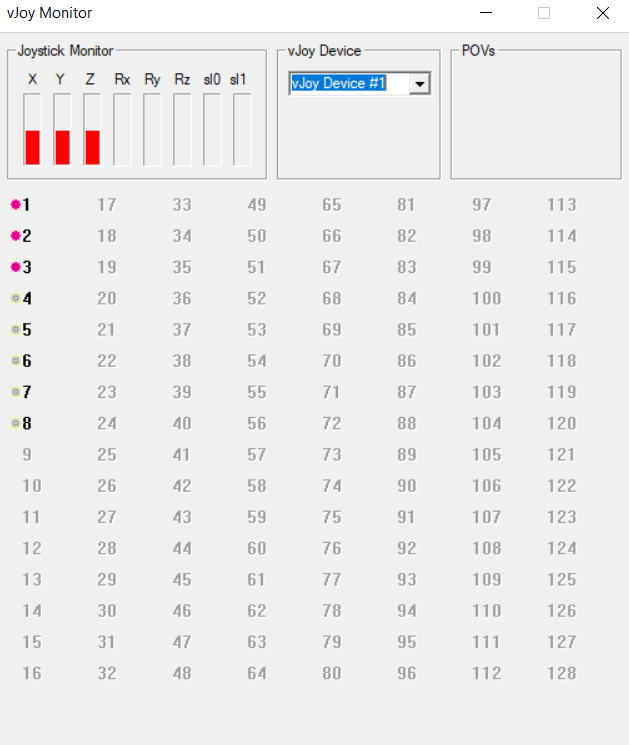

# vjoymingw
This project uses vjoy + mingw64 (msys2 specifically) + cmake to build a **hello world** application.

## narrative
At this point, a linux/posix developer.  I want to ultimatly foward events from a rPi, basically add a socket to [evtest.c](https://elinux.org/images/9/93/Evtest.c) and play it back in windows.

## install
- https://github.com/jshafer817/vJoy/releases/tag/v2.1.9.1
- Included libraries and DLLs are from v2.1.9.1 branch SDK, but report v2.1.83 or something in details
- https://www.msys2.org/
  - Run install from site and recommend
  - `pacman -S base-devel gcc vim cmake` (gcc wasnt installed for me using msys2 directions)
  - `pacman -S git` (if you want)

## build
Start msys2 bash
```
mkdir build
cd build
cmake ..
make
```

## run
```
./app.exe
```

## results

